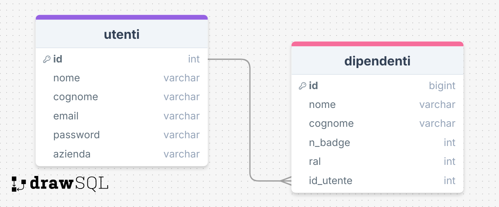
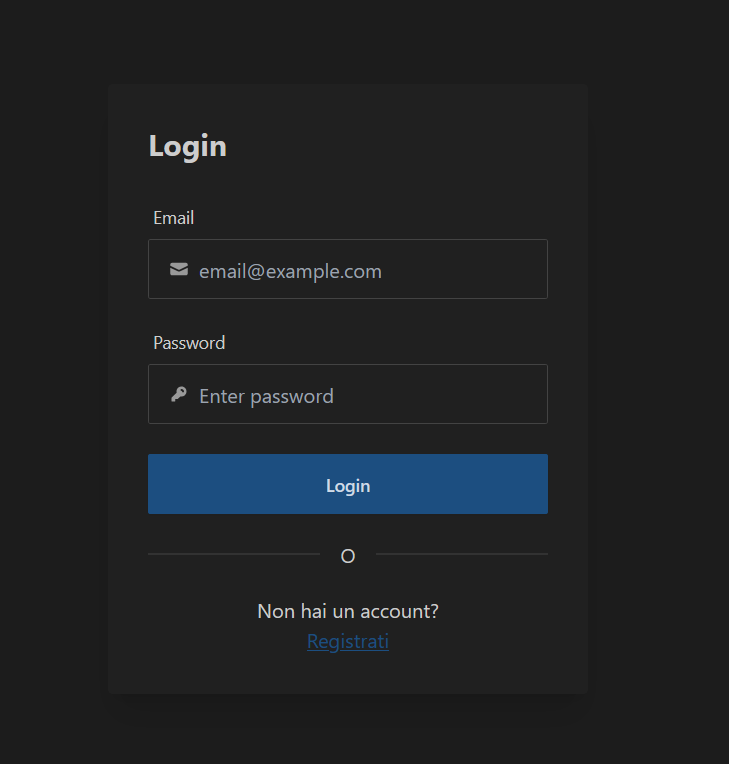
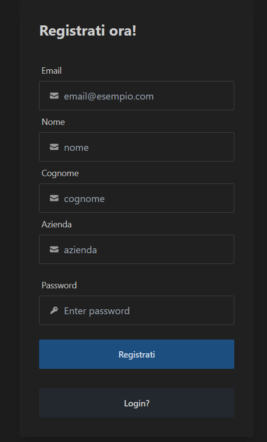
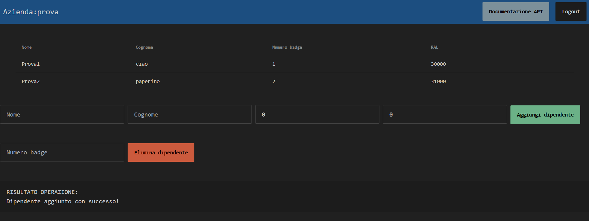
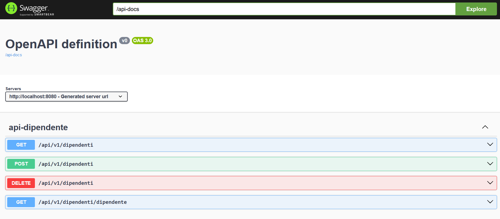

# Progetto: Gestione Dipendenti Spring Boot

## Descrizione
Il progetto è una web app sviluppata con Spring Boot che permette di registrarsi e di
gestire un database di dipendenti

1. Offre un'API REST documentata con **OpenAPI/Swagger**.
2. Utilizza **PostgreSQL** come database relazionale.
3. Usa **Spring JDBC** per l'interazione con il database.
4. Implementa un'interfaccia utente con il framework **Thymeleaf**, seguendo il pattern **MVC**.
5. Permette la registrazione e il login degli utenti, gestendo la sessione tramite lo scope **Request** e **Session** di Spring.

---

## Tecnologie Utilizzate
- **Spring** - **Spring Boot** - **PostgreSQL** - **JDBC Template** - **Thymeleaf** - **Spring Web** - **Swagger/OpenAPI**
---

## Funzionalità
1. **Registrazione Utente**:
    - Creazione di un account con i campi: nome, cognome, email, password e azienda.
    - Validazione dei dati dell'utente.
    - Memorizzazione delle credenziali nel database (password crittografata).

2. **Login Utente**:
    - Login con email e password.
    - Gestione delle sessioni (Session Scope di Spring).

3. **API REST**:
    - Endpoint per CRUD di risorse protette (accessibili solo agli utenti autenticati).

4. **Interfaccia Web (MVC)**:
    - Pagine per login, registrazione e dashboard dell'utente.

5. **Documentazione API**:
    - Generata con Swagger/OpenAPI e accessibile tramite l'URL `/swagger-ui.html`.

---

## Struttura del Progetto
1. **Controller Layer**:
    - Gestisce le richieste HTTP per l'interfaccia web (MVC) e le API REST.
    - Controller REST e Controller MVC sono separati.

2. **Service Layer**:
    - Contiene la logica applicativa per registrazione, login e gestione utenti.

3. **Repository Layer**:
    - Interagisce con il database PostgreSQL utilizzando Spring JDBC.

4. **Database**
    - Database relazionale PostgreSQL contenente Utenti e Dipendenti
    - 

5. **View Layer**:
    - Front-end gestito con Thymeleaf

---
## Immagini

### Pagina di login

### Pagina di registrazione

### Main page per la gestione dei dipendenti

### Documentazione API generata con SwaggerUI

## Deployment con Docker (In corso)
